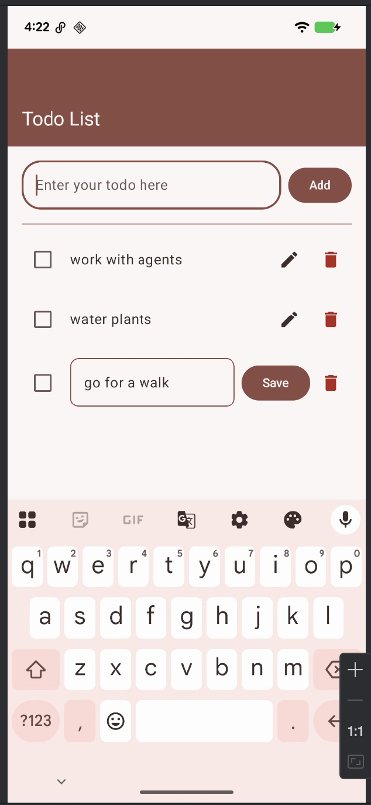

# Clean Todo App 📝

A modern, lightweight To-Do application built with **Jetpack Compose**, **Room Database**, and **Clean Architecture** principles.
This project demonstrates modern Android development practices, including reactive UI and offline-first data persistence.

## 🚀 Features
- **Create & Manage Tasks:** Easily add new todos to your list.
- **Offline First:** Uses **Room Persistence Library** to ensure your data stays on your device even without an internet connection.
- **Modern UI:** Built entirely with **Jetpack Compose** and **Material3** for a sleek, responsive user experience.
- **Edge-to-Edge Support:** Full utilization of the screen real estate with modern system bar handling.
- **Reactive Updates:** Uses `StateFlow` and `ViewModel` for real-time UI updates.

## 🛠 Tech Stack
- **Language:** [Kotlin](https://kotlinlang.org/)
- **UI Framework:** [Jetpack Compose](https://developer.android.com/jetpack/compose)
- **Architecture:** Clean Architecture with MVVM (Model-View-ViewModel)
- **Database:** [Room](https://developer.android.com/training/data-storage/room)
- **Dependency Management:** [Gradle Version Catalog (libs.versions.toml)](https://docs.gradle.org/current/userguide/platforms.html)

## 🏗 Project Structure
- `com.android.mr.cleantodoapp.data`: Contains the Room Database, DAOs, and Repository implementations.
- `com.android.mr.cleantodoapp.domain`: (Optional) Business logic and Repository interfaces.
- `com.android.mr.cleantodoapp.presentation`: Contains the `ViewModel` and `ViewModelFactory`.
- `com.android.mr.cleantodoapp.ui`: Houses the Compose screens, components, and Material3 themes.

## 🚦 Getting Started

### Prerequisites
- Android Studio Ladybug (or newer)
- JDK 17+
- Android SDK 35 (Target SDK)

### Installation
1. Clone the repository:
2. Open the project in Android Studio.
3. Sync Gradle and build the project.
4. Run the app on an emulator or physical device.
